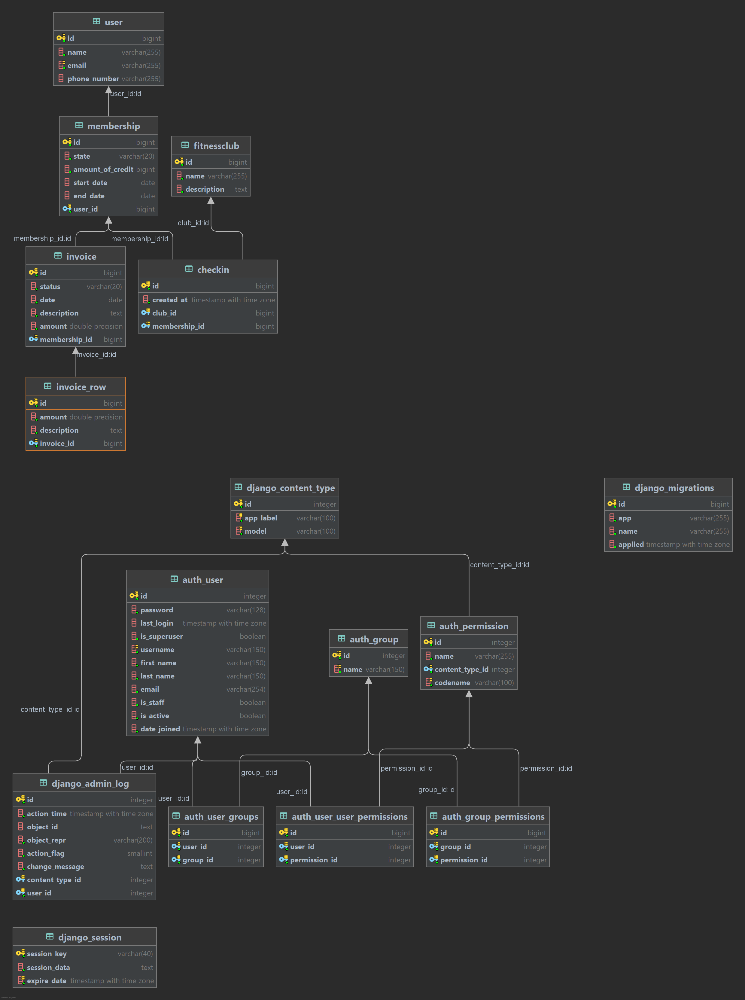

<<<<<<< HEAD
## Project specification

## Aim

    To develop a fitness club management software to manage and tracks users checkins across all clubs.

## Brief description scenarios

We’ve found the need to develop a basic system to manage invoices and track our users as they checkin to our fitness
clubs.

## PROJECT DIRECTORY OUTLINE

### config folder:

This folder contains the core system configuration file such as the settings.py, wsgi.py,asgi.py, and urls.py

The project is being modularized to 2 apps which are located inside the apps folder directory.

### apps folder:

This folder contains each of the app on the system such:

    1. core app: 
            This app handles the user related activities of a particular user

    2. invoice app: 
            This app handle all invoice related functionality of the system such as listing of all invoice attached to a 
            particular user.
    3. test:
            This directory contain files that entail the test cases for the api endpoints

### utils folder:

This folder contains all the global utility class, method that will be used in the system - Files - base.py - enums.py -
pagination.py

# Application setup

1. Clone the project to your local directory.
2. Copy the .env_sample into .env and set the following variable for example
   ```
    SECRET_KEY=
    DEBUG=
    ALLOWED_HOSTS=
    ```
    - Kindly note that ALLOWED_HOSTS value are needed to be separated by ``;`` in case there is need to allow more than
      1 host
3. Create a virtual environment and install the requirements.txt using
    ```
      pip install -r requirements.txt
   ```
4. Setup the database table by running the command below
    ```
   python manage.py makemigrations
   python manage.py migrate
   ```
5. run the project by running the command below
    ```
   python manage.py runserver
   ```

```
 Viola!!! visit 127.0.0.1:8000 to access the swagger ui
```

## TO RUN THE TEST SUITE

The test suite for this application is being developed using pytest , in order to run python using the command below

1. Run via command line without docker

```
   pytest
```

1. Run inside docker container

```
   docker-compose run web pytest
```

# Database Schema Diagram



## Docker installation and Setup

Docker is a platform designed to help developers build, share, and run modern applications,thereby handling the tedious
setup, so develop can focus on the code. To run this application in docker contain few steps are needed to be carried
out

1. Make sure you have docker installed on you local machine or download (mac with intel
   chip) https://www.docker.com/products/docker-desktop/
2. Run ``docker-compose up --build`` for initial setup of the application which take care of building all the required
   images needed for smooth operation,However for subsequent running of the application in docker
   use ``docker-compose up``
3. To power down the docker application Run ``docker-compose down`` which handle stopping of all services used in the
   application.

# Tech stack

    Python Django
    postgresSql
    pytest
=======
# fitness-club-manager-api
Develop a basic system to manage invoices and track our users as they check-in to  fitness clubs.
>>>>>>> main
